# How to set up Karaoke for Jellyfin

This guide takes you from a Jellyfin server to a working karaoke party: preparing your songs, setting up Jellyfin, installing the app, and optionally the Karaoke CDG plugin and the Karaoke Party channel. Every step and screenshot comes from a real Jellyfin 12.1 server (see [How this guide was tested](#14-how-this-guide-was-tested)).

There are two ways to set it up:

- **[Option A: the app only](#4-option-a-the-app-only).** Songs with synced lyrics, and CD+G songs if the app can read your music folder. Nothing to install in Jellyfin.
- **[Option B: the app and the Karaoke CDG plugin](#5-option-b-the-app-and-the-karaoke-cdg-plugin).** Everything in Option A, plus zipped karaoke songs, CD+G without giving the app your music folder, a **Karaoke** channel in every Jellyfin app, and videos rendered ahead of time.

Sections 1–3 apply to both options. Do them first, then follow the section for your option.

**Contents**

1. [What you need, and which option](#1-what-you-need-and-which-option)
2. [Prepare your songs](#2-prepare-your-songs)
3. [Set up Jellyfin](#3-set-up-jellyfin)
4. [Option A: the app only](#4-option-a-the-app-only)
5. [Option B: the app and the Karaoke CDG plugin](#5-option-b-the-app-and-the-karaoke-cdg-plugin)
6. [The Karaoke Party channel (optional, either option)](#6-the-karaoke-party-channel-optional-either-option)
7. [Example: Jellyfin, Tailscale and the app on one IP](#7-example-jellyfin-tailscale-and-the-app-on-one-ip)
8. [Users: Jellyfin accounts, guests and the host](#8-users-jellyfin-accounts-guests-and-the-host)
9. [Running a party](#9-running-a-party)
10. [App settings reference](#10-app-settings-reference)
11. [Plugin settings](#11-plugin-settings)
12. [Updating, and what needs a restart](#12-updating-and-what-needs-a-restart)
13. [Checking and troubleshooting](#13-checking-and-troubleshooting)
14. [How this guide was tested](#14-how-this-guide-was-tested)

---

## 1. What you need, and which option

**You need:**

- **Jellyfin 12.1** (the plugin targets 12.1; the app also works with other Jellyfin 12 versions).
- **Docker** with Docker Compose on the machine that runs the app (it can be the same machine as Jellyfin).
- A **TV** with a web browser, an Android TV device, or any device with a Jellyfin app (for the Karaoke Party channel).
- **Phones** on the same network as the app (or on the same Tailscale network, see section 7).

**Which option:**

| You want…                                                          | Option A | Option B |
| ------------------------------------------------------------------ | :------: | :------: |
| Songs with synced lyrics (`.lrc`)                                  |    ✓     |    ✓     |
| CD+G songs (`.mp3` + `.cdg` side by side)                          |   ✓ ¹    |    ✓     |
| Zipped CD+G songs (one `.zip` per song)                            |          |    ✓     |
| A **Karaoke** channel in Jellyfin's own apps (CD+G songs as video) |          |    ✓     |
| CD+G on TVs whose browser can't draw the graphics (video fallback) |          |    ✓     |
| The **Karaoke Party** channel (the whole party as Live TV)         |    ✓     |    ✓     |
| Nothing to install in Jellyfin                                     |    ✓     |          |

¹ Only when the app's container can mount your karaoke folder read-only. If Jellyfin runs on a NAS the app can't reach, use Option B.

If you have CD+G songs, Option B is the recommended setup.

## 2. Prepare your songs

Keep karaoke songs in **their own folder**, apart from your regular music. This lets you show phones only karaoke songs (section 3.2). Three kinds of karaoke songs work, and they can be mixed:

```
/path/to/karaoke/
├── Queen/
│   ├── Bohemian Rhapsody.mp3
│   └── Bohemian Rhapsody.lrc        ← synced lyrics, same name as the audio
├── Some Artist/
│   ├── Some Song.mp3
│   └── Some Song.cdg                ← CD+G graphics, same name as the audio
└── Zips/
    └── Some Artist - Some Song.zip  ← one .cdg + one audio file inside (Option B only)
```

- **Lyrics songs:** an audio file with a synced `.lrc` file of the same name next to it. Jellyfin reads it by itself, and the TV shows the lines in time with the music.
- **CD+G songs:** an audio file with a `.cdg` file of the same name (`.cdg`, `.CDG` or `.Cdg`). The TV draws the karaoke graphics.
- **Zipped songs (Option B):** a zip holding exactly one `.cdg` and one audio file (MP3, M4A, FLAC, OGG, WAV…). Name it `Artist - Title.zip` if the audio has no tags. The plugin makes them searchable without unzipping your collection.

Phones list songs that have lyrics or CD+G graphics, badged **Karaoke**; songs with neither are hidden (`SONG_FILTER`, section 10).

## 3. Set up Jellyfin

### 3.1 Add a library for the karaoke folder

Mount the karaoke folder into Jellyfin (read-only is fine), for example at `/media/karaoke`, next to your regular music at `/media/music`. Then in Jellyfin open **Dashboard → Libraries → Libraries → Add Media Library**, choose content type **Music**, name it (for example **Karaoke Tracks**) and add the `/media/karaoke` folder. Let the scan finish.

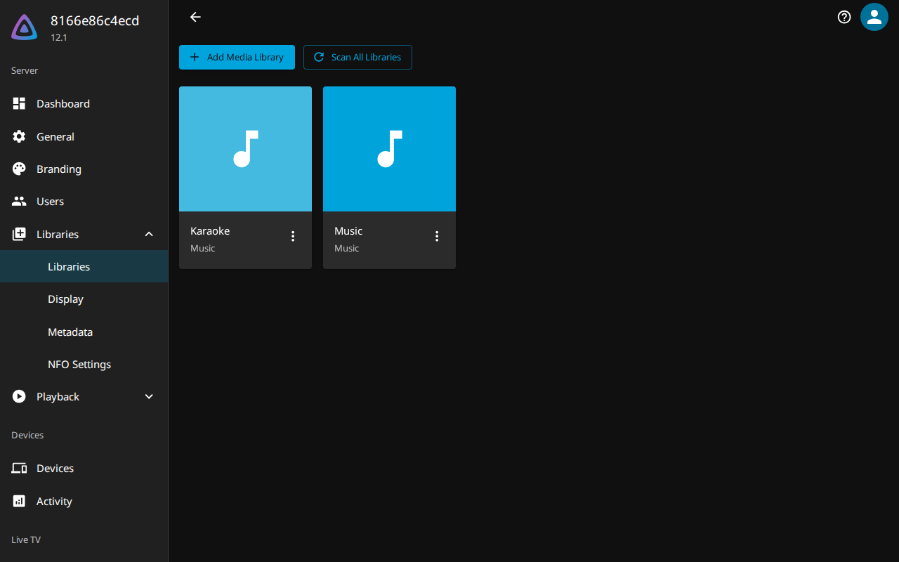

_In this test server, "Music" holds the songs and "Karaoke" is the library the plugin creates for zipped songs (Option B)._

### 3.2 Create a karaoke-only user

The app shows phones whatever its Jellyfin user can see. A user that can only see the karaoke libraries keeps your regular music out of browsing, title search and song lists.

1. **Dashboard → Users → +**, name the user `karaoke`, give it a password.
2. Open the user, **Access** tab. Untick **Enable access to all libraries** and tick only your karaoke libraries: **Karaoke Tracks**, plus the plugin's **Karaoke** library if you use Option B with zipped songs. Leave **Enable access to all channels** ticked. Save.

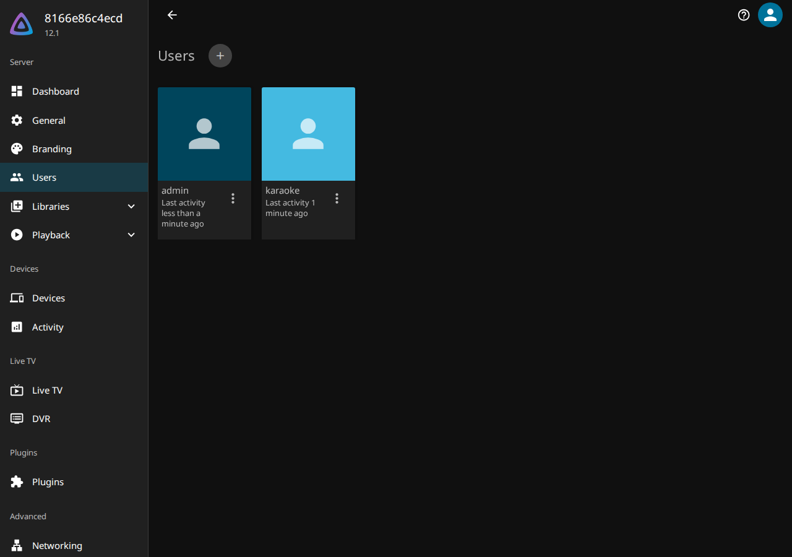

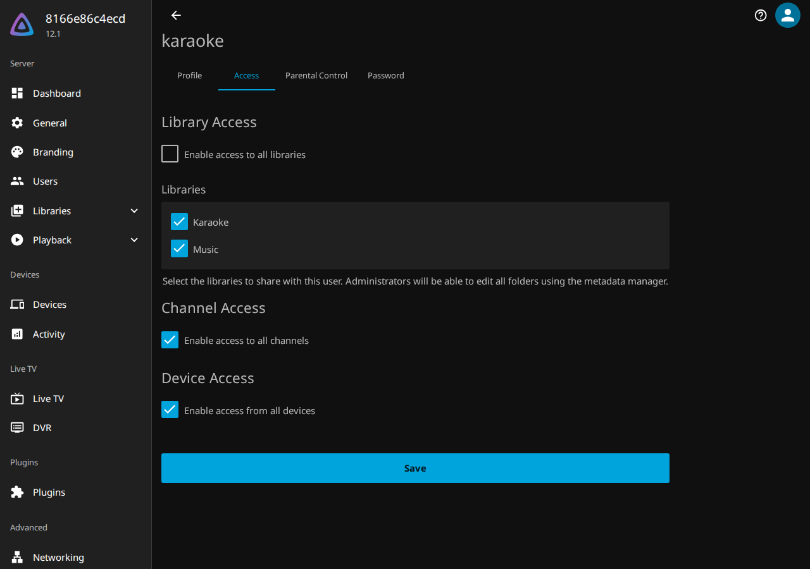

Changes to this user's access apply to the next search; the app needs no restart. (`JELLYFIN_MUSIC_LIBRARY` is no substitute: it only narrows the artist list.)

### 3.3 Create an API key

**Dashboard → API Keys → New API Key**, name it `karaoke`. Copy the key for the app's `JELLYFIN_API_KEY`.

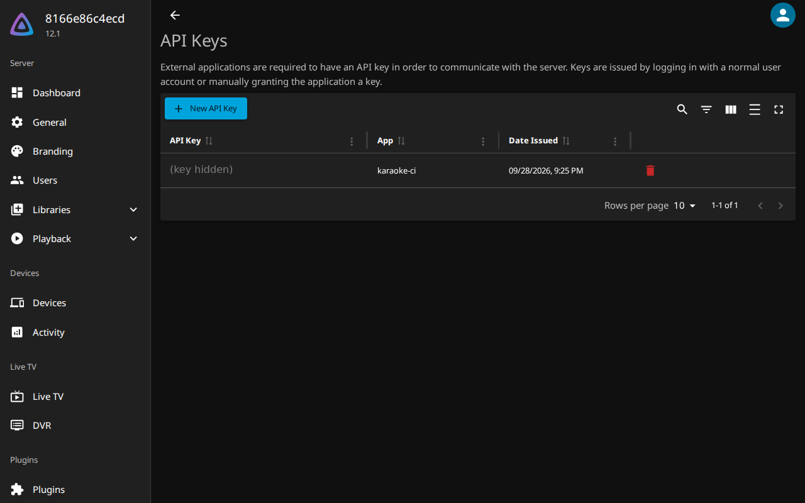

## 4. Option A: the app only

### 4.1 Start the app

Create a folder with this `docker-compose.yml` (replace the addresses and the key):

```yaml
services:
  karaoke:
    image: mrorbitman/karaoke-for-jellyfin:latest
    container_name: karaoke
    ports:
      - 3967:3000 # phones and the TV use http://<this machine>:3967
    environment:
      # Must work from the phones too: album art loads straight from Jellyfin
      - JELLYFIN_SERVER_URL=http://192.168.1.50:8096
      - JELLYFIN_API_KEY=your-api-key # section 3.3
      - JELLYFIN_USERNAME=karaoke # the user from section 3.2
      # CD+G without the plugin: the karaoke folder, read-only, and the same
      # folder as Jellyfin sees it (section 4.2). Remove if you have no CD+G songs.
      - CDG_LOCAL_ROOT=/karaoke
      - CDG_JELLYFIN_ROOT=/media/karaoke
      # Optional, see section 10
      # - LIVE_CHANNEL=true               # the Karaoke Party channel (section 6)
      # - PUBLIC_URL=http://192.168.1.50:3967
      # - PLAYBACK_STALL_ACTION=skip
      # - LOG_LEVEL=info
    volumes:
      - /path/to/karaoke:/karaoke:ro
    restart: unless-stopped
```

```bash
docker compose up -d
docker compose exec karaoke npm run check:jellyfin   # Jellyfin reachable, key works, user exists
```

Then open `http://<this machine>:3967/tv` on the TV and scan its QR code with a phone (section 9).

### 4.2 CD+G without the plugin

The app finds a song's `.cdg` file by asking Jellyfin for the song's path, swapping `CDG_JELLYFIN_ROOT` for `CDG_LOCAL_ROOT`, and reading the file next to the audio. So:

- Mount **only the karaoke folder**, read-only, into the app.
- `CDG_LOCAL_ROOT` is where it is inside the app container; `CDG_JELLYFIN_ROOT` is the same folder as Jellyfin reports it. If the two are the same path, leave out `CDG_JELLYFIN_ROOT`.
- If your karaoke songs are a subfolder of the music library, use that subfolder, for example `CDG_JELLYFIN_ROOT=/media/music/Karaoke`.
- Windows paths from Jellyfin work too: `CDG_JELLYFIN_ROOT=D:\Karaoke`.
- The app never reads outside `CDG_JELLYFIN_ROOT`.

How the graphics are found and drawn is described in [docs/CDG.md](docs/CDG.md).

## 5. Option B: the app and the Karaoke CDG plugin

### 5.1 Install the plugin

1. Get `Jellyfin.Plugin.KaraokeCdg.dll`: download the `jellyfin-plugin-karaoke-cdg` artifact from the latest **Jellyfin plugin** workflow run on GitHub, or build it with the .NET 10 SDK:
   ```bash
   dotnet publish jellyfin-plugin/Jellyfin.Plugin.KaraokeCdg -c Release -o jellyfin-plugin/artifacts
   ```
2. In Jellyfin's plugin folder, create a folder named `KaraokeCdg_1.0.1.0` and copy the DLL into it. The plugin folder is `/config/plugins/` in Docker (so `./jellyfin/config/plugins/KaraokeCdg_1.0.1.0/` on the host with the compose files below), `/var/lib/jellyfin/plugins/` on Linux, and `%ProgramData%\Jellyfin\Server\plugins\` on Windows. When updating, delete the old `KaraokeCdg_1.0.0.0` folder.
3. Restart Jellyfin (`docker compose restart jellyfin`).
4. **Dashboard → Plugins → Karaoke CDG** shows **Status: Active, Version 1.0.1.0**. The plugin needs Jellyfin's ffmpeg, which the official image includes.

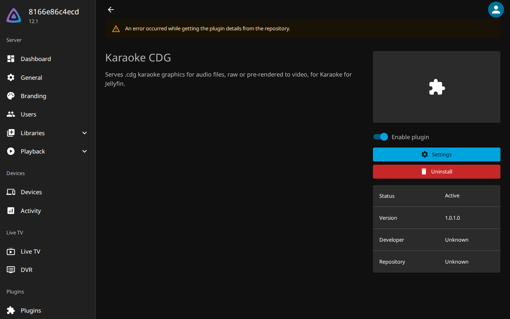

_The "error while getting the plugin details from the repository" banner only means the plugin isn't in an online catalogue; it's harmless._

### 5.2 Set up the plugin

Open **Dashboard → Plugins → Karaoke CDG → Settings**. The defaults work; these are the recommended values:

| Setting                                                         | Recommended                                    | Why                                                                                         |
| --------------------------------------------------------------- | ---------------------------------------------- | ------------------------------------------------------------------------------------------- |
| Show the Karaoke channel in Jellyfin's apps                     | on                                             | CD+G songs as videos in every Jellyfin app                                                  |
| Render videos for Karaoke for Jellyfin                          | on                                             | The TV's fallback when its browser can't draw the graphics                                  |
| Video folder                                                    | empty (Jellyfin's cache)                       | Keep Jellyfin's `/cache` on a persistent volume so videos survive restarts                  |
| Keep unplayed videos for (days)                                 | 30                                             | Rendered videos take about 7 MB per 4-minute song                                           |
| Always keep recently played videos                              | 100                                            |                                                                                             |
| **Zip folders**                                                 | **your karaoke folder**, e.g. `/media/karaoke` | Empty means every music library, which reads through all your regular music                 |
| Placeholder folder                                              | empty                                          | Placeholders go in Jellyfin's data folder, in their own library                             |
| Put placeholders next to each zip                               | off                                            | Keeps your karaoke folder untouched (it can stay read-only)                                 |
| Create a Karaoke library                                        | on                                             | The library holding the zipped songs' placeholders                                          |
| Watch zip folders for new zips                                  | on for local disks, off for network shares     | New zips show up in about 30 seconds instead of at the next scan (after a Jellyfin restart) |
| Extraction folder                                               | empty (Jellyfin's cache)                       |                                                                                             |
| Keep unused extracted songs (hours) / Always keep recently used | 24 / 100                                       |                                                                                             |

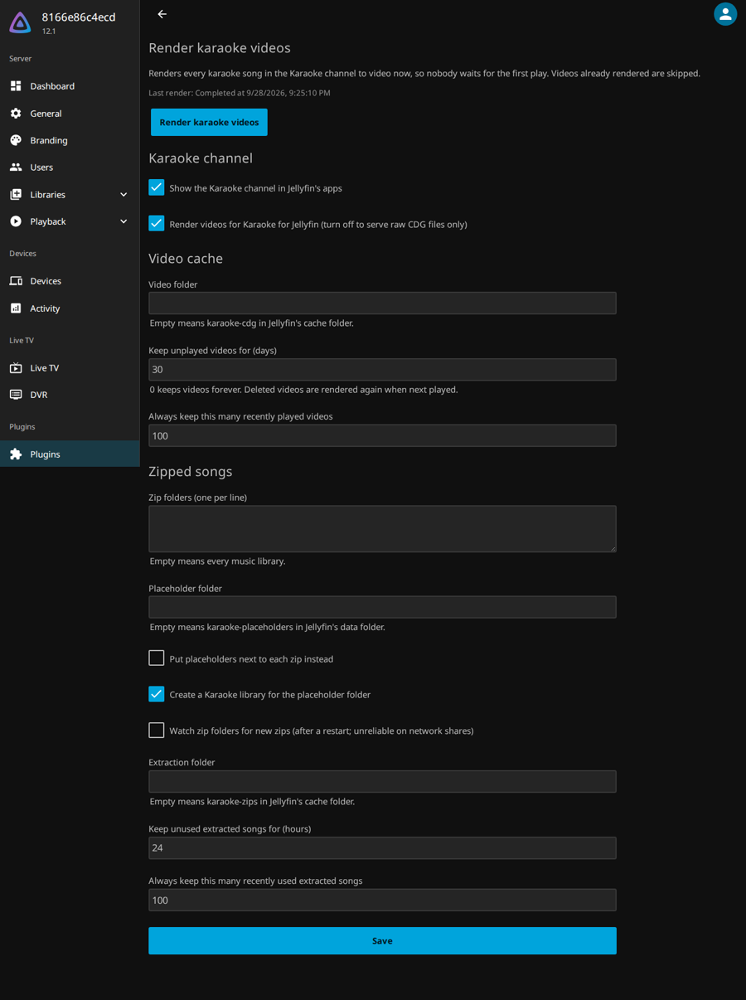

After changing **Zip folders**, run **Dashboard → Libraries → Scan All Libraries** so the placeholders are made now. Then give the `karaoke` user access to the new **Karaoke** library (section 3.2).

Every setting is described in the [plugin README](jellyfin-plugin/README.md#settings), with how zipped songs, placeholders and the caches work.

### 5.3 Render every song ahead (optional)

A CD+G song's video is rendered the first time it's needed (10–15 seconds on a 4-core CPU). To avoid that wait, click **Render karaoke videos** at the top of the plugin settings. It first shows how many songs, how long and how much space it will take, and starts only when you confirm. You can stop it at any time; finished videos are kept.

### 5.4 The Karaoke channel in Jellyfin's apps

**Karaoke** appears in every Jellyfin app (web, Android, Android TV, iOS…), with one folder per artist. Each CD+G song plays as a video with its graphics and audio, like any other video. Users only see songs from libraries they can access. This channel doesn't use the app at all.

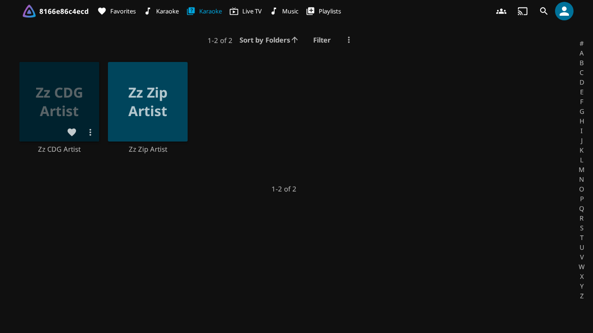

### 5.5 Start the app

Use the compose file from section 4.1 **without** the CD+G mount: the app gets the graphics from the plugin.

```yaml
services:
  karaoke:
    image: mrorbitman/karaoke-for-jellyfin:latest
    container_name: karaoke
    ports:
      - 3967:3000
    environment:
      - JELLYFIN_SERVER_URL=http://192.168.1.50:8096
      - JELLYFIN_API_KEY=your-api-key
      - JELLYFIN_USERNAME=karaoke
      # Optional, see section 10
      # - CDG_MODE=auto                   # auto | canvas | video | off
      # - CDG_PRERENDER=false             # don't render queued songs ahead
      # - LIVE_CHANNEL=true               # the Karaoke Party channel (section 6)
      # - PUBLIC_URL=http://192.168.1.50:3967
    restart: unless-stopped
```

With the plugin, the TV draws CD+G graphics in the browser and falls back to the plugin's video, then to lyrics. Queued songs are rendered ahead, so the video is ready by the time a song comes up.

## 6. The Karaoke Party channel (optional, either option)

The app can play the whole party as a Live TV channel in Jellyfin, so any Jellyfin app can be the TV instead of a browser on `/tv`. Phones still add songs from the party page.

| Waiting                                             | Lyrics song                                             | Up next                                         | CD+G song                                          |
| --------------------------------------------------- | ------------------------------------------------------- | ----------------------------------------------- | -------------------------------------------------- |
| 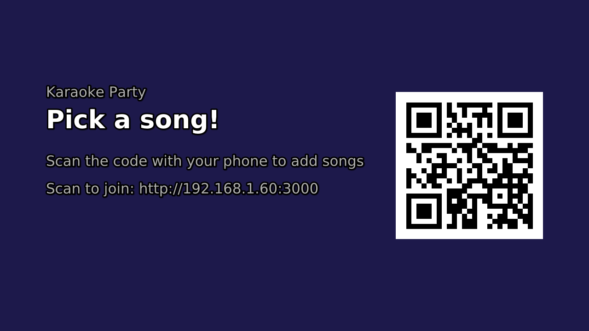 | 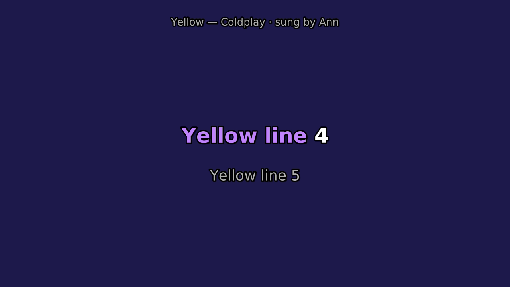 |  |  |

_Frames from the channel as a Jellyfin client received it. The CD+G frame is the test file's simple graphics._

**Set it up:**

1. Add `LIVE_CHANNEL=true` to the app, and `PUBLIC_URL=http://<app address>` (the address phones join on, for the channel's QR code). Recreate the app: `docker compose up -d karaoke`. The image includes ffmpeg.
2. In Jellyfin: **Dashboard → Live TV → Add Tuner Device**. Tuner type **M3U Tuner**, **File or URL** `http://<app address>/api/live/channel.m3u` (for example `http://192.168.1.50:3967/api/live/channel.m3u`). Leave the other fields at their defaults (**Allow stream sharing** on, so several TVs share one stream). Save.
   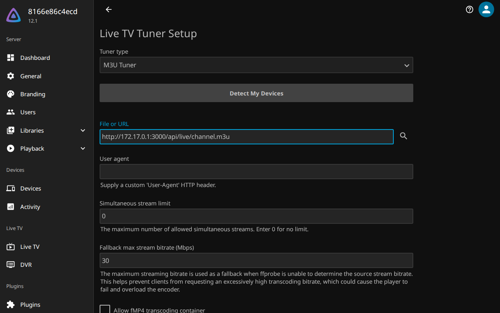
3. **Karaoke Party** appears under **Live TV → Channels** in every Jellyfin app, for every user with Live TV access. If it doesn't show straight away, click **Refresh Guide Data** on the Live TV page.
   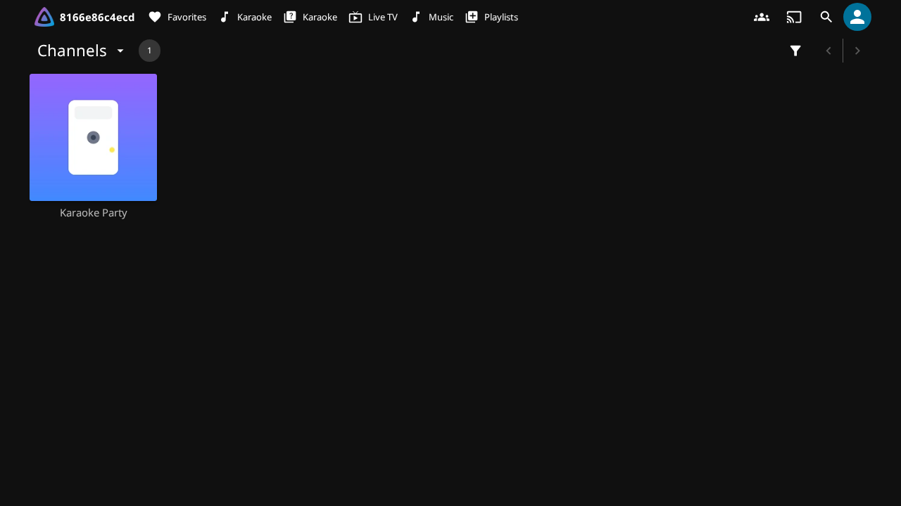

**What it shows:** CD+G songs with their graphics (from the plugin or the mount, as on the TV page); other songs on a plain background with their lyrics filling in word by word, or the title when there are none; an **Up next** card with the singer and the QR code between songs (`LIVE_NEXT_UP_SECONDS`, 8); a **Pick a song!** card when the queue is empty; a **Paused** card while paused.

**How it behaves:**

- **It runs only while someone watches.** Encoding starts when Jellyfin tunes in and stops 30 seconds after the last viewer; meanwhile the queue waits. It takes about a third of one CPU core while running.
- **The app keeps time:** songs end when their audio ends. Browser autoplay rules don't apply.
- **It's 5–15 seconds behind**, like any live TV: phones see "Now playing" change a little before the TV, and skip and pause reach the TV after the same delay.
- **Use the channel or the `/tv` page for a party, not both.** While the channel is watched, it ends songs itself and ignores the TV page.
- **The QR code** shows `PUBLIC_URL`, or else the address Jellyfin used to reach the app. Set `PUBLIC_URL` whenever Jellyfin reaches the app by an address phones can't use (like `localhost` or a Docker address).
- `http://<app address>/api/live/status` shows whether it's running and what it's showing. `/api/live/channel.m3u?format=hls` gives an HLS version for players that prefer it.

## 7. Example: Jellyfin, Tailscale and the app on one IP

This setup gives Jellyfin and the app one address on your LAN (a macvlan IP) and on your Tailscale network, through a Tailscale sidecar container that both share. Phones at home use Wi-Fi; guests or you away from home use Tailscale; the same QR code works for both.

`docker-compose.yml`:

```yaml
services:
  # Owns the network: the LAN IP (macvlan) and the tailnet IP.
  # Jellyfin and the karaoke app join its network namespace.
  tailscale:
    image: tailscale/tailscale:latest
    container_name: tailscale
    hostname: karaoke # name on the tailnet (MagicDNS)
    environment:
      - TS_AUTHKEY=${TS_AUTHKEY} # tailscale.com → Settings → Keys
      - TS_STATE_DIR=/var/lib/tailscale
      - TS_USERSPACE=false # real tailscale0 interface
      # Let tailnet devices reach the LAN IP too, so one address
      # (JELLYFIN_SERVER_URL, the QR code) works at home and away.
      # Approve the route in the Tailscale admin console.
      - TS_ROUTES=192.168.1.60/32
    volumes:
      - ./tailscale:/var/lib/tailscale
    devices:
      - /dev/net/tun:/dev/net/tun
    cap_add:
      - NET_ADMIN
    networks:
      lan:
        ipv4_address: 192.168.1.60
    restart: unless-stopped

  jellyfin:
    image: jellyfin/jellyfin:12.1
    container_name: jellyfin
    network_mode: service:tailscale # :8096 on 192.168.1.60 and the tailnet IP
    depends_on:
      tailscale:
        condition: service_started
        restart: true # rejoin the namespace when tailscale restarts
    environment:
      - JELLYFIN_PublishedServerUrl=http://192.168.1.60:8096
    volumes:
      - ./jellyfin/config:/config # plugin: ./jellyfin/config/plugins/KaraokeCdg_1.0.1.0/
      - ./jellyfin/cache:/cache # rendered videos and extracted zips
      # Regular music and karaoke in separate folders and libraries
      - /path/to/music:/media/music:ro # library "Music"
      - /path/to/karaoke:/media/karaoke:ro # library "Karaoke Tracks"
    # devices:
    #   - /dev/dri:/dev/dri # hardware transcoding
    restart: unless-stopped

  karaoke:
    image: mrorbitman/karaoke-for-jellyfin:latest
    container_name: karaoke
    network_mode: service:tailscale # :3000 on 192.168.1.60 and the tailnet IP
    depends_on:
      tailscale:
        condition: service_started
        restart: true
      jellyfin:
        condition: service_started
    environment:
      # Phones load album art from this URL, so use the LAN IP, not localhost
      - JELLYFIN_SERVER_URL=http://192.168.1.60:8096
      - JELLYFIN_API_KEY=${JELLYFIN_API_KEY}
      - JELLYFIN_USERNAME=${JELLYFIN_USERNAME:-karaoke}
      - NODE_ENV=production
      - PORT=3000 # must not clash with Jellyfin: they share one IP
      - HOSTNAME=0.0.0.0
      # The Karaoke Party channel (section 6); its QR code needs the LAN address
      - LIVE_CHANNEL=true
      - PUBLIC_URL=http://192.168.1.60:3000
      # Option A only: the karaoke folder for CD+G (not needed with the plugin)
      # - CDG_LOCAL_ROOT=/karaoke
      # - CDG_JELLYFIN_ROOT=/media/karaoke
    # volumes:
    #   - /path/to/karaoke:/karaoke:ro
    restart: unless-stopped

networks:
  lan:
    driver: macvlan
    driver_opts:
      parent: eth0 # the host's LAN interface (ip -br link)
    ipam:
      config:
        - subnet: 192.168.1.0/24
          gateway: 192.168.1.1
          ip_range: 192.168.1.60/32 # keep Docker off other LAN addresses
```

`.env` next to it:

```bash
TS_AUTHKEY=tskey-auth-...
JELLYFIN_API_KEY=your-api-key
JELLYFIN_USERNAME=karaoke
```

**Steps:**

1. Replace `192.168.1.60`, the subnet, the gateway and `eth0` with your own. Pick an IP outside your router's DHCP range.
2. `docker compose up -d tailscale jellyfin`, set up Jellyfin (section 3; and section 5 for the plugin), put the API key in `.env`, then `docker compose up -d karaoke`.
3. In the Tailscale admin console, approve the `192.168.1.60/32` route for the `karaoke` machine. Tailnet devices can then use the LAN addresses, which album art needs. Phones use approved routes automatically; Linux needs `--accept-routes`.
4. Open the TV at `http://192.168.1.60:3000/tv`. The QR code shows the address the TV page was opened on, so guests get the LAN address.
5. For the channel, the M3U tuner URL is `http://192.168.1.60:3000/api/live/channel.m3u` (or `http://localhost:3000/…`, since they share networking; `PUBLIC_URL` keeps the QR code right either way).

| Where                     | Phones                     | TV page                       | Jellyfin                   |
| ------------------------- | -------------------------- | ----------------------------- | -------------------------- |
| Home Wi-Fi                | `http://192.168.1.60:3000` | `http://192.168.1.60:3000/tv` | `http://192.168.1.60:8096` |
| Tailscale, route approved | the same                   | the same                      | the same                   |
| Tailscale, no route       | `http://karaoke:3000`      | `http://karaoke:3000/tv`      | `http://karaoke:8096`      |

- The Docker host can't reach its own macvlan IP; other LAN devices can. Add a macvlan shim on the host, or use the tailnet name, to reach it from the host.
- Restarting the Tailscale container cuts off the other two. `depends_on … restart: true` restarts them too (Docker Compose 2.17+); otherwise run `docker compose restart jellyfin karaoke`.
- All three share one IP, so ports must differ: the app uses 3000, Jellyfin 8096.
- Leave `TRUST_PROXY` off: phones connect directly. Set `TRUST_PROXY=true` only behind a reverse proxy (such as `tailscale serve`, nginx or Traefik).

## 8. Users: Jellyfin accounts, guests and the host

- **Jellyfin admin:** your own account, for the setup in sections 3, 5 and 6.
- **The `karaoke` Jellyfin user:** used only by the app (`JELLYFIN_USERNAME`). It decides which songs phones see. It needs no Jellyfin app access of its own, but it's fine to sign in with it to watch the Karaoke Party or Karaoke channel.
- **Guests:** no Jellyfin accounts. They open the app on their phone, type their name and join. The name is remembered on that phone.
- **The host:** `http://<app address>/admin` on any device. There is no password on the admin page or the TV page, so keep the app on your LAN or tailnet, not on the open internet.
- **Watching the channels in Jellyfin:** any Jellyfin user with **Live TV** access (Karaoke Party) or channel access (Karaoke) can watch.

## 9. Running a party

### The TV

Open `http://<app address>/tv` in the TV's browser, or use the [Android TV app](docs/ANDROID_TV_BUILD.md), or watch the Karaoke Party channel (section 6).

| Waiting for songs                        | CD+G song                         | Lyrics song                            |
| ---------------------------------------- | --------------------------------- | -------------------------------------- |
| 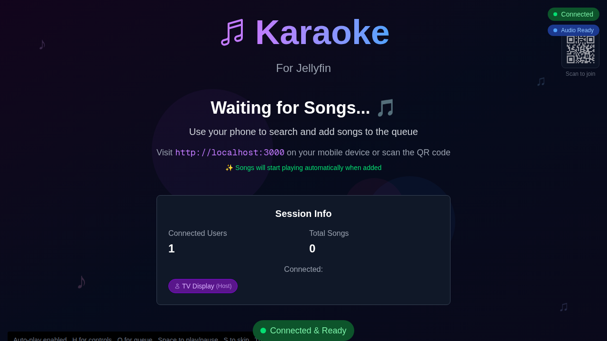 | 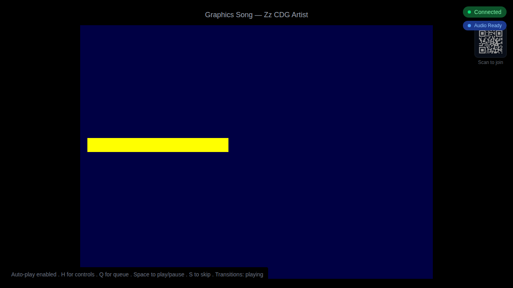 | 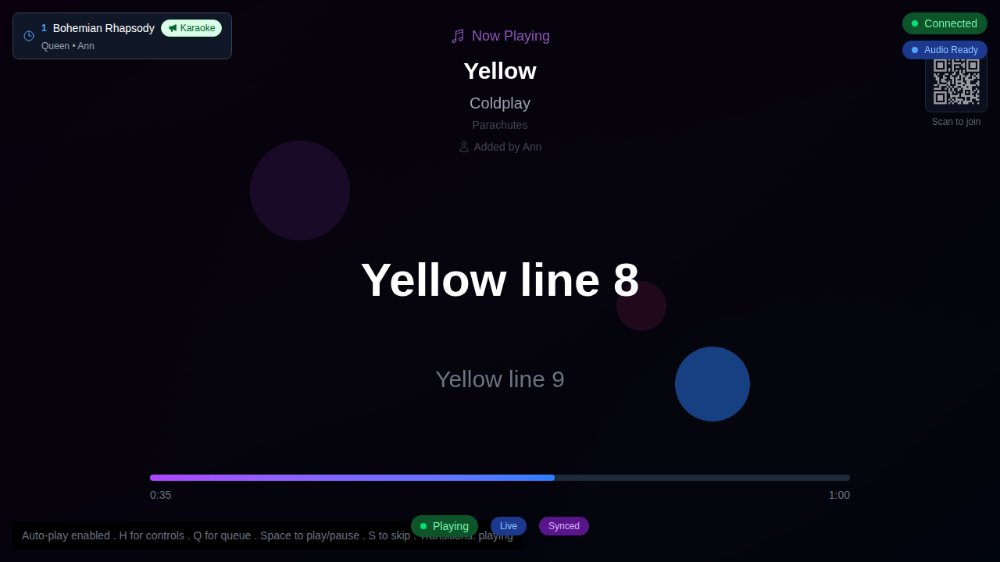 |

- **Press OK once** (or any key, or tap) after opening the page if the TV shows **Press OK or tap the screen to turn on sound**: most browsers won't play sound until someone interacts with the page. Allowing autoplay for the site in the browser's settings avoids it.
  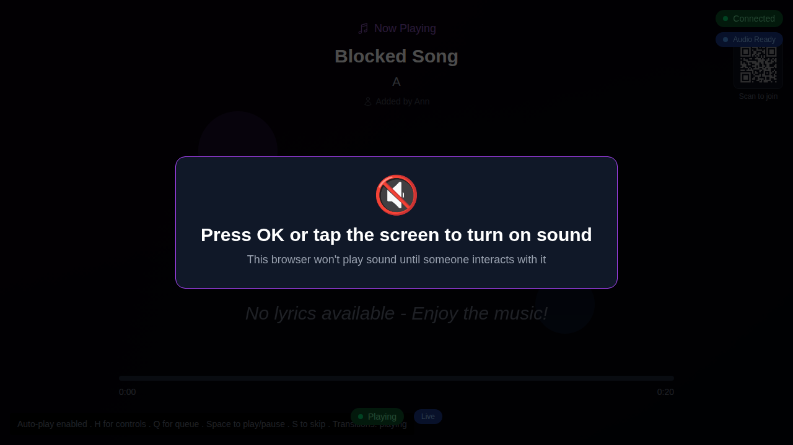
- **Keys:** H shows the host controls, Q the queue, Space plays or pauses, S skips.
- After each song the TV shows a (random) rating, then the next song's splash, then plays it.
- If a song is playing but the TV makes no progress for 60 seconds (stuck buffering, a sleeping TV, blocked sound), the phones are told; with `PLAYBACK_STALL_ACTION=skip` the song is skipped too.

### Phones

| Join                               | Artists                                  | An artist's songs                           | Added                                     | Queue                                |
| ---------------------------------- | ---------------------------------------- | ------------------------------------------- | ----------------------------------------- | ------------------------------------ |
| 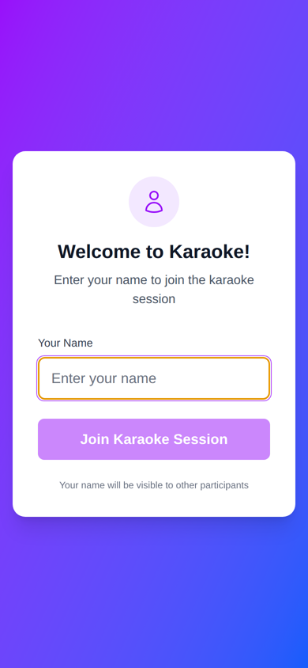 | 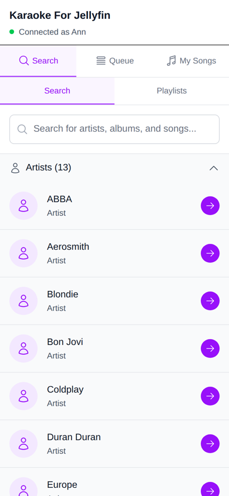 | 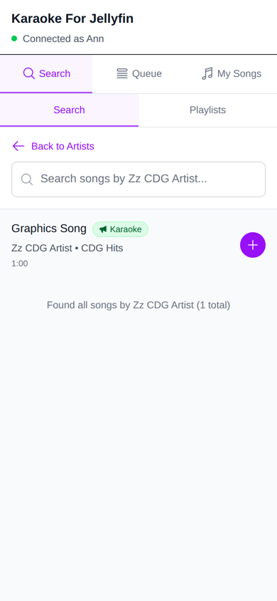 | 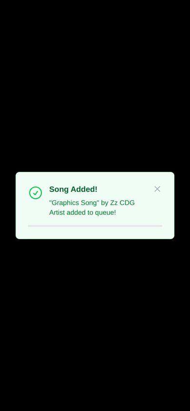 | 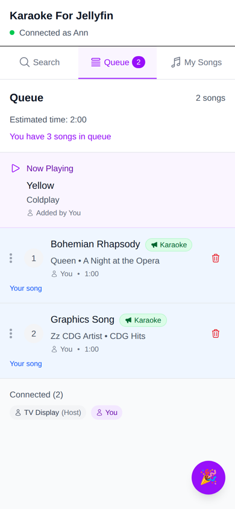 |

- **Search** by artist or title, or browse **Playlists** (`PLAYLIST_FILTER_REGEX` limits which playlists show).
- **Queue:** the current song and what's next. Songs rotate fairly between singers, so one person can't fill the queue. You can remove your own songs.
- **My Songs:** your history and favorites.
- **Reactions:** the 🎉 button sends emoji that float across the TV while a song plays.

### The host page

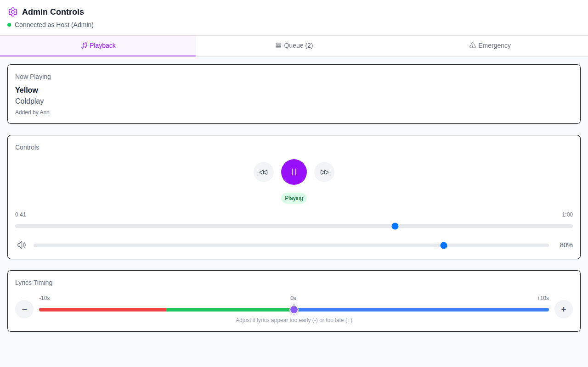

`/admin` has three tabs: **Playback** (play, pause, skip, seek, volume, lyrics timing), **Queue** (see and remove songs), and **Emergency** (stop, restart the song, and system status). Everything syncs to the TV straight away.

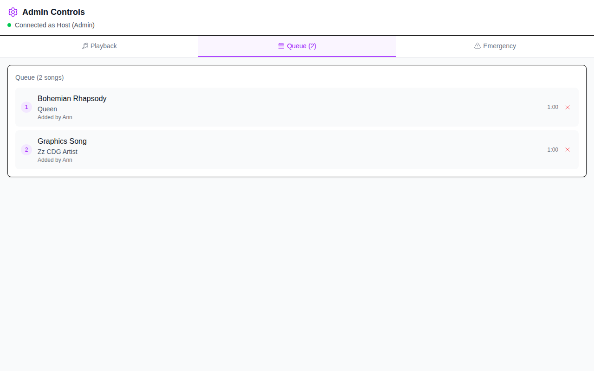

## 10. App settings reference

All settings are environment variables on the app container. Only the first three are required.

| Setting                                   | Default                        | What it does                                                                                                                  |
| ----------------------------------------- | ------------------------------ | ----------------------------------------------------------------------------------------------------------------------------- |
| `JELLYFIN_SERVER_URL`                     | –                              | Jellyfin's address. Must also work from phones (album art loads from it)                                                      |
| `JELLYFIN_API_KEY`                        | –                              | API key from section 3.3                                                                                                      |
| `JELLYFIN_USERNAME`                       | –                              | The Jellyfin user whose libraries phones see (section 3.2)                                                                    |
| `SONG_FILTER`                             | `karaoke`                      | Songs phones list: `karaoke` (lyrics or CD+G), `lyrics` (lyrics only), `all`                                                  |
| `JELLYFIN_MUSIC_LIBRARY`                  | the only music library, or all | List artists from this library only (doesn't limit title search; use the user's access instead)                               |
| `PLAYLIST_FILTER_REGEX`                   | all playlists                  | Only show playlists whose names match, e.g. `^(Karaoke\|Sing)`                                                                |
| `CDG_MODE`                                | `auto`                         | `auto` (draw in the browser, fall back to plugin video), `canvas`, `video` (always plugin video, for weak TV browsers), `off` |
| `CDG_LOCAL_ROOT` / `CDG_JELLYFIN_ROOT`    | –                              | Option A CD+G: the karaoke folder inside the app, and as Jellyfin sees it (section 4.2)                                       |
| `CDG_PRERENDER`                           | on                             | `false` stops asking the plugin to render queued songs ahead                                                                  |
| `LIVE_CHANNEL`                            | off                            | `true` turns on the Karaoke Party channel (section 6)                                                                         |
| `PUBLIC_URL`                              | the address Jellyfin used      | The address phones join on, for the channel's QR code                                                                         |
| `LIVE_NEXT_UP_SECONDS`                    | `8`                            | How long the channel's Up next card shows                                                                                     |
| `FFMPEG_PATH`                             | `ffmpeg`                       | ffmpeg for the channel (included in the image)                                                                                |
| `PLAYBACK_STALL_SECONDS`                  | `60`                           | Seconds without progress on the TV before phones are told (0 turns it off)                                                    |
| `PLAYBACK_STALL_ACTION`                   | `notify`                       | `skip` also skips the stuck song                                                                                              |
| `RATING_ANIMATION_DURATION`               | `15000`                        | Milliseconds the rating shows after a song                                                                                    |
| `NEXT_SONG_DURATION`                      | `15000`                        | Milliseconds the next-song splash shows                                                                                       |
| `CONTROLS_AUTO_HIDE_DELAY`                | `10000`                        | Milliseconds before the TV's controls hide                                                                                    |
| `AUTOPLAY_DELAY` / `QUEUE_AUTOPLAY_DELAY` | `500` / `1000`                 | Milliseconds before the TV starts a song                                                                                      |
| `TIME_UPDATE_INTERVAL`                    | `2000`                         | Milliseconds between the TV's position reports                                                                                |
| `TRUST_PROXY`                             | off                            | `true` behind a reverse proxy, so limits apply per phone                                                                      |
| `LOG_LEVEL` / `LOG_FORMAT`                | `info` / `text`                | `debug`, `info`, `warn`, `error`; `json` for log collectors                                                                   |
| `ENABLE_DEBUG_ROUTES`                     | off                            | `true` enables `/api/debug/*` in production (no login)                                                                        |
| `LYRICS_PATH`, `JELLYFIN_MEDIA_PATH`      | `/lyrics`, `/media`            | Extra folders searched for lyrics files named `jellyfin_<item id>.lrc` (advanced; `.lrc` next to the audio is simpler)        |
| `PORT` / `HOSTNAME`                       | `3000` / `0.0.0.0`             | Where the app listens inside the container                                                                                    |
| `KARAOKE_SERVER_URL`                      | –                              | Only for building the Android TV app                                                                                          |

For a faster party, shorten the screens between songs, for example `RATING_ANIMATION_DURATION=8000` and `NEXT_SONG_DURATION=5000`.

## 11. Plugin settings

The recommended values are in section 5.2. The full list, the plugin's endpoints, and how placeholders and caches behave are in the [plugin README](jellyfin-plugin/README.md).

## 12. Updating, and what needs a restart

- **The app:** `docker compose pull karaoke && docker compose up -d karaoke`.
- **The plugin:** replace the DLL in a folder named for the new version (`KaraokeCdg_<version>`), delete the old folder, restart Jellyfin.

| Change                                                    | What to do                                                       |
| --------------------------------------------------------- | ---------------------------------------------------------------- |
| New folder mounted into Jellyfin                          | `docker compose up -d jellyfin`, then add the library and scan   |
| Any app setting (`JELLYFIN_USERNAME`, `CDG_*`, `LIVE_*`…) | `docker compose up -d karaoke`                                   |
| A new library while the app runs                          | `docker compose up -d karaoke` (it picks its library at startup) |
| The `karaoke` user's library access                       | Nothing: applies to the next search                              |
| The plugin's settings                                     | Nothing; run a library scan to make zip placeholders now         |
| Which songs are badged Karaoke                            | Nothing: updates within about 15 minutes                         |

Use `docker compose up -d`, not `restart`, which keeps the old settings. Recreating the app empties the queue (it's kept in memory), so do it before the party; phones reconnect by themselves.

## 13. Checking and troubleshooting

**Checks:**

- `docker compose exec karaoke npm run check:jellyfin`: Jellyfin reachable, API key works, user exists.
- `http://<app address>/api/health`: the app, Jellyfin and plugin status (`?strict=1` answers 503 when Jellyfin has problems, for monitors).
- `http://<jellyfin>/Karaoke/Status` (signed in to Jellyfin): the plugin's version, ffmpeg, placeholder counts and settings warnings.
- `http://<app address>/api/live/status`: the Karaoke Party channel.
- **Logs:** `docker compose logs -f karaoke`. They include errors from the TV and phones' browsers, mask API keys, and with `LOG_LEVEL=debug` show every request.

**Problems:**

| Problem                                                                   | Fix                                                                                                                                             |
| ------------------------------------------------------------------------- | ----------------------------------------------------------------------------------------------------------------------------------------------- |
| TV shows **Press OK or tap the screen to turn on sound**                  | Press OK (or any key) once. The log says `[client:tv] The browser blocked sound`. Allow autoplay for the site, or use the channel               |
| Songs sit at 0:00 and get skipped after 60 s                              | Same cause: the TV's browser blocked sound (older app versions had no prompt)                                                                   |
| Regular music shows on phones                                             | Check the `karaoke` user's library access (3.2) and that `JELLYFIN_USERNAME` is that user; the log's first line says `Authenticated as user: …` |
| No album art on phones                                                    | `JELLYFIN_SERVER_URL` must be reachable from the phones, not just from the app                                                                  |
| QR code points somewhere phones can't reach                               | Open the TV page on the LAN address; for the channel, set `PUBLIC_URL`                                                                          |
| CD+G songs show lyrics or nothing                                         | Option A: check the mount and `CDG_*` paths. Option B: check `/Karaoke/Status`, and that the song's `.cdg` has the same name as the audio       |
| A zipped song is missing                                                  | Check **Zip folders**, run a library scan, and look for `Could not read <zip>` in Jellyfin's log (the plugin retries on the next pass)          |
| Karaoke Party channel missing in Jellyfin                                 | Check the tuner URL opens in a browser (`/api/live/channel.m3u`), then **Refresh Guide Data**. The user needs Live TV access                    |
| The channel's first song starts slowly                                    | CD+G videos render on first use; render ahead (5.3)                                                                                             |
| Jellyfin logs `M3UTunerHost: Error getting channels … Connection refused` | Jellyfin started before the app (after a reboot, say). Harmless: the channel plays as soon as the app is up, with no refresh needed             |
| Lyrics too early or late                                                  | Lyrics timing on the admin page                                                                                                                 |
| An old version keeps showing                                              | Visit `/clear-cache`, use the cache panel on the admin page, or force-refresh the browser                                                       |
| Can't reach the app from the Docker host (macvlan)                        | Expected with macvlan; use another device, a macvlan shim or the tailnet name                                                                   |

## 14. How this guide was tested

On 28 September 2026, against a real **Jellyfin 12.1** container (`jellyfin/jellyfin:12.1`) with the Karaoke CDG plugin 1.0.1.0 and the test library the project's CI builds (lyrics songs, a `.cdg` song, a zipped song, a song with neither):

- **Plugin checks** (CI's `plugin-checks.js`): placeholders, `/Karaoke/Songs`, render estimate/start/cancel/complete, admin-only access, video cache: all passed.
- **Acceptance tests** (all 52 Playwright scenarios, including headed full playback): all passed.
- **Karaoke-only user:** with access to the Karaoke library only, phones saw only the zipped song (artist list and title search); after adding the Music library, it appeared at the next search with no restart.
- **Karaoke Party channel:** added through Jellyfin's M3U tuner; Jellyfin's direct stream played continuously (100 s read), its HLS stream played (45 s read), and the queue ran by itself: waiting card → lyrics song → Up next → CD+G song.
- **Karaoke channel:** listed by artist for the `karaoke` user; the CD+G song played through Jellyfin as a 900×648 H.264 + AAC video.
- **Screenshots** in this guide come from that server, in a desktop browser (1280×720/800) and a phone-sized one (390×844).
- **The next morning** (29 September): the test machine had been shut down overnight (the cloud environment reclaims idle machines), so Jellyfin and the app came back cold, like a server rebooted in the morning, with everything on disk kept:
  - Jellyfin came back with the plugin active, the zip placeholder, the rendered videos and the Karaoke Party tuner in place. It started before the app, so it logged `Error getting channels`; the channel then played as soon as the app was up, with nothing refreshed (see Troubleshooting).
  - The Karaoke Party channel played through Jellyfin again: a CD+G song, then a lyrics song over Jellyfin's HLS stream (60 s, no errors). One read of Jellyfin's direct stream stopped after 29 s on the reading side while Jellyfin kept receiving the whole song from the app; the HLS stream, which the web app and most TV apps use, played in full.
  - The plugin checks passed again. The render check first reported "0 of 2 to render" because yesterday's videos were still cached, as intended; with the cache emptied, it passed.
- **Long idle, then use:** a TV page and a phone stayed connected and idle for 2 hours (checked every 10 minutes: all 13 checks connected and healthy, no browser errors). Jellyfin's hourly karaoke tasks ran meanwhile without errors. The phone then queued a song through its UI and the TV played it with synced lyrics within seconds. The app logged no unexpected errors.
