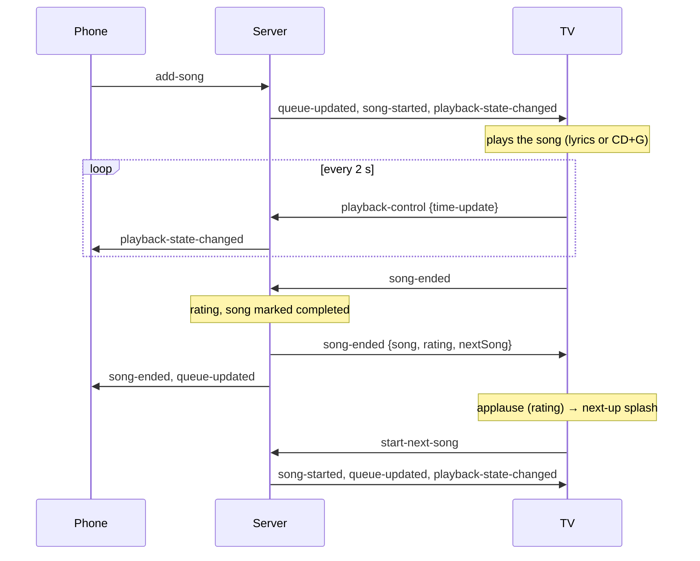

# Socket events and song transitions

How the phones, the host page, the TV and the server talk over Socket.IO, and how a song moves from queued to finished. This is a reference for working on the code; setup is in [HOWTO.md](HOWTO.md).

## The basics

- **One party at a time.** `server.js` runs Next.js and Socket.IO on the same port and keeps a single session, `main-session`, in memory. Restarting the app empties it.
- **The TV** connects with `?client=tv` and joins automatically as **TV Display** (a new TV replaces an old one).
- **Phones and the host page** send `join-session` with the singer's name. A name that is already connected replaces its old connection.
- **Heartbeats:** clients send `user-heartbeat` every 30 seconds; users not seen for 5 minutes are removed (checked every 2 minutes). When the last user leaves, the session ends.
- **Safety** (`server/socket-guard.js`): every handler's errors are caught and reported to that client as `error`; the payloads of the main events are validated first; user-driven events are rate-limited per connection (`RATE_LIMITS`), answering `error` with code `RATE_LIMITED`.

## Client → server

| Event              | Payload                        | Sent by           | What the server does                                                                                                                                    | Limit / min |
| ------------------ | ------------------------------ | ----------------- | ------------------------------------------------------------------------------------------------------------------------------------------------------- | ----------- |
| `join-session`     | `{ sessionId, userName }`      | phones, host page | Joins (creating the session if needed); answers `session-updated`, tells others `user-joined`                                                           | 20          |
| `add-song`         | `{ mediaItem, position? }`     | phones            | Inserts with fair rotation between singers; starts it if nothing is playing; asks the plugin to prepare and render it ahead                             | 30          |
| `remove-song`      | `{ queueItemId }`              | phones, host      | Removes a pending song                                                                                                                                  | 60          |
| `reorder-queue`    | `{ queueItemId, newPosition }` | TV, host          | Moves a waiting song to `newPosition` among the waiting songs (the playing song stays put); answers `SONG_NOT_FOUND` if it isn't waiting                | 60          |
| `skip-song`        | –                              | TV, host, phones  | Ends the current song and starts the next one straight away (see [Skips](#skips))                                                                       | 30          |
| `playback-control` | `{ action, value? }`           | TV, host          | `play`, `pause`, `seek`, `volume`, `mute`, `lyrics-offset`: updates the state and broadcasts it. `time-update`: the TV's position, passed to the others | –           |
| `song-ended`       | –                              | TV                | The song finished: rating and `song-ended` (see below). Ignored while the Karaoke Party channel is watched                                              | –           |
| `start-next-song`  | –                              | TV                | After the between-song screens: starts the next pending song. Ignored while the channel is watched                                                      | –           |
| `playback-failed`  | `{ title, reason }`            | TV                | Logs it and sends everyone a `notice` ("… couldn't play … and was skipped")                                                                             | 30          |
| `send-reaction`    | `{ emoji }`                    | phones            | Broadcasts `reaction-received`                                                                                                                          | 60          |
| `user-heartbeat`   | –                              | everyone          | Marks the user as seen                                                                                                                                  | –           |

## Server → client

| Event                       | Payload                                                      | When                                                                 |
| --------------------------- | ------------------------------------------------------------ | -------------------------------------------------------------------- |
| `session-joined`            | `{ session, userId, queue, currentSong, playbackState }`     | To the TV when it connects                                           |
| `session-updated`           | `{ session, queue, currentSong, playbackState }`             | To a phone or host page that sent `join-session`                     |
| `user-joined` / `user-left` | the user / `{ userId }`                                      | To the others when someone joins or leaves                           |
| `queue-updated`             | `QueueItem[]`                                                | Whenever the queue changes                                           |
| `song-started`              | `QueueItem`                                                  | A song starts                                                        |
| `song-ended`                | `{ song, rating, nextSong }` (after a skip: the song itself) | A song ends                                                          |
| `playback-state-changed`    | `PlaybackState`                                              | Play, pause, seek, volume, mute, lyrics offset, position updates     |
| `reaction-received`         | `{ id, emoji, userId, userName, timestamp }`                 | Someone sent a reaction                                              |
| `notice`                    | `{ level, message }`                                         | A song couldn't play, the TV seems stuck, the channel skipped a song |
| `error`                     | `{ code, message }`                                          | A request was invalid, rate-limited or failed                        |

## A song from start to finish



### The TV's screens

The TV's `TransitionState` moves through:

```
waiting → playing → applause → next-up → playing (next song)
                             ↘ waiting (queue empty)
```

- **applause:** `RatingAnimation` with the (random, server-generated) grade and the next song; lasts `RATING_ANIMATION_DURATION`.
- **next-up:** `NextSongSplash`; lasts `NEXT_SONG_DURATION`, then the TV sends `start-next-song`.

### Skips

`skip-song` marks the song skipped, sends `song-ended` with the song itself (no rating), and starts the next song immediately with `song-started`, without the applause and next-up screens.

### When something goes wrong

- **Audio error or stuck loading:** the TV retries once from where it stopped; if that fails it sends `playback-failed` and skips.
- **No progress:** if a song is playing with a TV connected and no `time-update` arrives with a new position for `PLAYBACK_STALL_SECONDS`, the server logs it and sends a `notice` (and skips with `PLAYBACK_STALL_ACTION=skip`). See `server/playback-watchdog.js`.

### With the Karaoke Party channel

While Jellyfin watches the channel, the channel is the TV (`server/live/`): it calls `completeCurrentSong()` and `startNextSong()` in `server.js` itself, shows its own "Up next" card for `LIVE_NEXT_UP_SECONDS`, reports the position every 2 seconds, and the socket `song-ended` and `start-next-song` events are ignored.

## The queue over REST

- `GET /api/queue`: a read-only view of the live queue, `{ success, data: { queue, currentSong, playbackState, session } }`; 404 before anyone has joined.
- `POST`, `PUT` and `DELETE /api/queue` answer 410: change the queue over Socket.IO.
- The old REST session store (`src/services/session/`), its handlers (`src/app/api/queue/handlers/`) and `src/lib/websocket/` are commented out and kept for reference; they never shared state with the socket queue.

## Known gaps

- **`lyrics-sync`** is declared for clients but never sent; the TV syncs lyrics itself from `/api/lyrics`.
